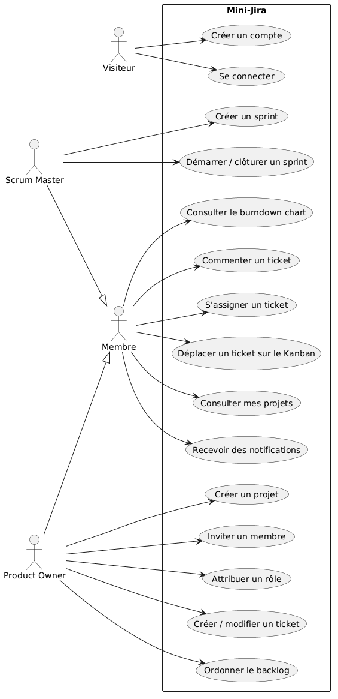
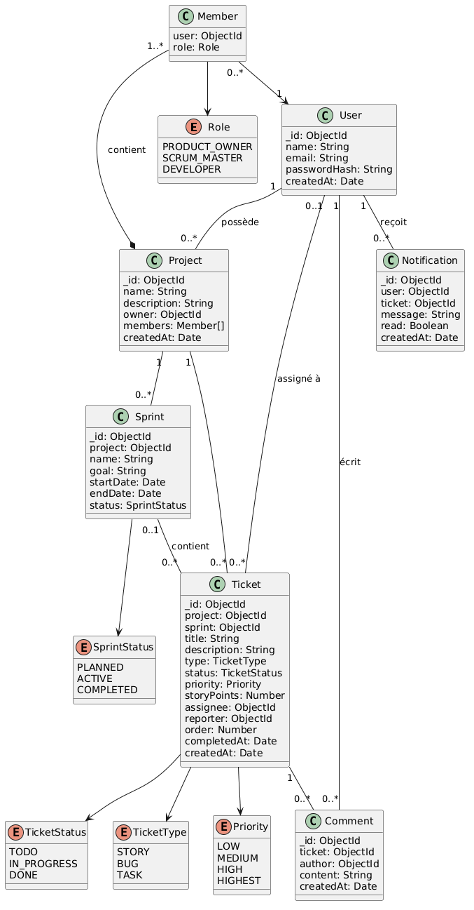

# Mini-Jira

Plateforme de gestion de projets agile inspirée de Jira : backlog, sprints Scrum, tableau Kanban en temps réel.

> 🚧 Projet en cours de développement (octobre 2026)

## Fonctionnalités prévues

- Authentification JWT et gestion des rôles (Product Owner, Scrum Master, développeur)
- Backlog et gestion des sprints
- Tableau Kanban avec glisser-déposer
- Commentaires et assignation de tickets
- Notifications en temps réel (Socket.io)
- Burndown chart

## Stack technique

| Couche | Technologies |
|---|---|
| Front-end | React, TypeScript |
| Back-end | Node.js, Express |
| Base de données | MongoDB |
| Temps réel | Socket.io |
| DevOps | Docker, GitHub Actions |
| Conception | Figma, UML |
| Gestion de projet | Jira (Scrum, sprints d'une semaine) |

## Structure du dépôt

```
mini-jira/
├── client/   # Application React + TypeScript
├── server/   # API Node.js + Express
└── docs/     # Diagrammes UML, maquettes, captures Jira
```

## Méthodologie

Le projet est piloté en Scrum avec des sprints d'une semaine. Le backlog et les sprints sont suivis dans Jira.


## Conception

### Cas d'utilisation


### Diagramme de classes


Voir aussi le [modèle de données et l'API](docs/data-model.md).

## Installation

### Prérequis

- [Docker Desktop](https://www.docker.com/products/docker-desktop/)
- Git

### Lancer le projet

```bash
git clone https://github.com/Nohayla10/mini-jira.git
cd mini-jira
docker compose up --build
```

| Service | URL |
|---|---|
| Client React | http://localhost:5173 |
| API | http://localhost:5000/api/health |
| MongoDB | localhost:27017 |

### Commandes utiles

```bash
docker compose down        # arrêter
docker compose down -v     # arrêter et supprimer la base de données
```

## Auteur

Nohayla Ait Ben Salah — [LinkedIn](https://www.linkedin.com/in/nohayla-ait-ben-salah-815361298/) · [GitHub](https://github.com/Nohayla10)

## Licence

MIT
